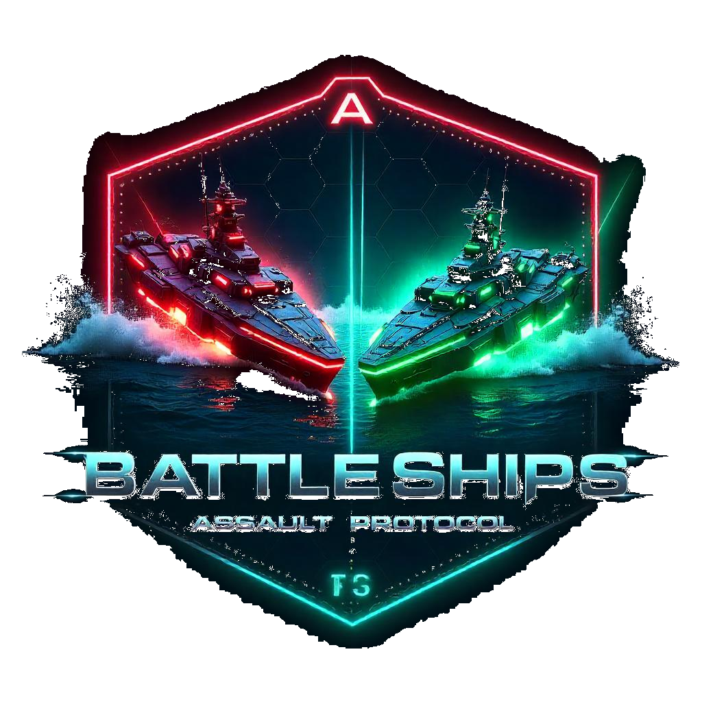

# 🚢 BattleShips: Assault Protocol

A modern, feature-rich Battleship game with hierarchical user management, multiple game modes, and real-time multiplayer capabilities.



## 🏗️ Project Structure

```
BattleShips/
├── README.md                          # This file
└── battleship-game-102/               # Main game application
    ├── index.html                     # Entry point
    ├── package.json                   # Dependencies & scripts
    ├── vite.config.js                 # Vite configuration
    ├── tailwind.config.js             # Tailwind CSS config
    ├── eslint.config.js               # ESLint configuration
    ├── vercel.json                    # Deployment config
    ├── FEATURE_DOCUMENTATION.md       # Detailed feature docs
    ├── SUPERADMIN_FEATURES.md         # SuperAdmin capabilities
    ├── AUTONOMOUS_RANDOM_GAMES.md     # Random game mechanics
    │
    ├── public/                        # Static assets
    │   └── vite.svg
    │
    ├── src/                           # Source code
    │   ├── main.jsx                   # React entry point
    │   ├── App.jsx                    # Main app component
    │   ├── App.css                    # Global styles
    │   ├── index.css                  # Base styles
    │   ├── firebase.js                # Firebase configuration
    │   │
    │   ├── assets/                    # Game assets
    │   │   ├── background.jpg
    │   │   └── logo.png
    │   │
    │   ├── components/                # React components
    │   │   ├── GameBoard.jsx          # Game grid component
    │   │   ├── ShipPlacement.jsx      # Ship placement interface
    │   │   ├── GameControls.jsx       # Game control panel
    │   │   ├── GameStatus.jsx         # Game status display
    │   │   ├── PlayerGrid.jsx         # Player's grid component
    │   │   ├── TurnTimer.jsx          # Turn countdown timer
    │   │   ├── AbilityPanel.jsx       # Special abilities UI
    │   │   ├── AbilityIndicator.jsx   # Ability status display
    │   │   ├── AbilityInfoBubble.jsx  # Ability information
    │   │   ├── AdminControls.jsx      # Admin game controls
    │   │   ├── AdminLogin.jsx         # Admin authentication
    │   │   ├── SuperAdminLogin.jsx    # SuperAdmin login
    │   │   ├── ActiveRoomsMonitor.jsx # Room monitoring
    │   │   ├── RoomJoinForm.jsx       # Room entry form
    │   │   ├── StopWatch.jsx          # Game timer
    │   │   └── Toast.jsx              # Notification system
    │   │
    │   ├── contexts/                  # React contexts
    │   │   ├── FirebaseContext.jsx    # Firebase state
    │   │   └── GameContext.jsx        # Game state management
    │   │
    │   ├── hooks/                     # Custom React hooks
    │   │   └── useFirebase.js         # Firebase utilities
    │   │
    │   ├── pages/                     # Page components
    │   │   ├── Home.jsx               # Landing page
    │   │   ├── GameRoom.jsx           # Main game interface
    │   │   ├── AdminPanel.jsx         # Admin dashboard
    │   │   ├── AdminRoomView.jsx      # Admin game oversight
    │   │   ├── SuperAdminPanel.jsx    # SuperAdmin controls
    │   │   └── RandomGameWaiting.jsx  # Matchmaking screen
    │   │
    │   ├── services/                  # Business logic
    │   │   ├── firebaseConfig.js      # Firebase setup
    │   │   ├── gameService.js         # Core game logic
    │   │   ├── abilityService.js      # Special abilities
    │   │   ├── adminService.js        # Admin operations
    │   │   ├── userService.js         # User management
    │   │   ├── cleanupService.js      # Data cleanup
    │   │   ├── gameModesService.js    # Game mode handlers
    │   │   └── initService.js         # Initialization
    │   │
    │   └── utils/                     # Utility functions
    │       ├── deviceDetect.js        # Device detection
    │       └── testFeatures.js        # Feature testing
    │
    └── build/                         # Production build output
```

## 🎯 Game Overview

BattleShips: Assault Protocol is a modern web-based battleship game featuring a sophisticated user hierarchy system, multiple game modes, and real-time multiplayer gameplay. The game maintains the classic battleship experience while adding contemporary features like special abilities, custom game configurations, and comprehensive administration tools.

## 👥 User Hierarchy System

### 🔴 SuperAdmin
- **Purpose**: Ultimate system control and admin management
- **Access**: Default credentials - Username: `admin`, Password: `battleship2024`
- **Capabilities**:
  - Create and manage Admin accounts with custom credentials
  - Set granular admin permissions (host games, custom games, manage games)
  - View comprehensive game and room history across the entire platform
  - Access SuperAdmin panel at `/super-admin`
  - Monitor all active rooms and ongoing games
  - Manage system-wide settings and configurations

### 🟡 Admin
- **Purpose**: Game hosting and room management
- **Access**: Login at `/admin-login` with SuperAdmin-created credentials
- **Capabilities**:
  - Host regular games with custom room codes
  - Create custom games with advanced settings:
    - Variable grid sizes (6x6, 8x8, 10x10, 12x12)
    - Adjustable ship counts (few/default/many)
    - Enable/disable special abilities
    - Set turn time limits (15-120 seconds)
  - Oversee ongoing games with real-time admin view
  - Manage game state (pause/resume/restart games)
  - Grant or revoke abilities to players during gameplay
  - Access detailed game analytics and player statistics

### 🟢 Players
- **Purpose**: Core gameplay experience
- **Access**: No registration required - join games directly
- **Capabilities**:
  - Strategic ship placement on customizable grids
  - Attack enemy positions with tactical precision
  - Utilize special abilities when enabled by admins
  - Participate in multiple game modes
  - Real-time gameplay with turn-based mechanics

## 🎮 Game Modes

### 1. 🎯 Random Matchmaking
- **Access**: Click "Find Random Game" on the home page
- **Features**:
  - Automatic matching with other waiting players
  - Dynamic loading screen with search animations
  - 30-second timeout with option to continue waiting
  - Auto-start when both players are ready and ships are placed
  - Standard configuration: 8x8 grid, default ships, abilities enabled
- **Experience**: Fully autonomous gameplay - no admin intervention required

### 2. 👨‍💼 Admin-Hosted Games
- **Access**: Admin creates room with custom room code
- **Features**:
  - Full admin oversight and real-time control
  - Custom room codes defined by admin (e.g., "BATTLE001", "TOURNAMENT")
  - Advanced game settings and configurations
  - Admin can modify game parameters during gameplay
  - Comprehensive game monitoring and analytics

### 3. 👫 Friendly Games
- **Access**: Click "Create Friendly Game" on home page
- **Features**:
  - Shareable room codes with "FR_" prefix (e.g., "FR_ABC123")
  - Custom game settings:
    - Grid size options: 6x6, 8x8, 10x10
    - Ship count variations: Few (3), Default (5), Many (7)
    - Turn time limits: 30-180 seconds
  - One-click room code sharing via clipboard
  - Private matches between friends
  - Auto-start when both players are ready

### 4. ⚙️ Custom Admin Games
- **Access**: Admin panel with advanced game creation tools
- **Features**:
  - Extended grid sizes up to 12x12
  - Granular ship configuration options
  - Advanced ability management systems
  - Precise time controls and game parameters
  - Tournament-style configurations

## 🚀 Key Features

### ⚡ Real-Time Gameplay
- **Technology**: Firebase Realtime Database for instant updates
- **Performance**: Sub-second response times for all game actions
- **Synchronization**: Perfect state consistency across all players
- **Reliability**: Automatic reconnection and state recovery

### 🎨 Responsive Design
- **Mobile-First**: Optimized for touch devices and mobile gameplay
- **Adaptive UI**: All components scale perfectly across screen sizes
- **Touch Controls**: Intuitive drag-and-drop ship placement
- **Accessibility**: Keyboard navigation and screen reader support

### ⏱️ Advanced Timer System
- **Visual Countdown**: Progress bar with real-time updates
- **Warning States**: Color-coded alerts at 10 seconds remaining
- **Auto-Switch**: Automatic turn progression on timeout
- **Flexible Limits**: Configurable from 15 to 180 seconds per turn

### 🎯 Special Abilities (Optional)
- **HACKER**: Reveal opponent ship locations
- **REINFORCEMENT**: Add additional ship segments
- **ANNIHILATE**: Destroy entire rows or columns
- **JAM**: Block incoming attacks
- **GODS_HAND**: Target large grid areas
- **COUNTER_ATTACK**: Automatic retaliation system

### 📊 Analytics & History
- **Game Logging**: Comprehensive data for every match
- **Search & Filter**: Find games by mode, players, or date
- **Performance Metrics**: Win rates and game duration statistics
- **Admin Insights**: Room usage and player behavior analytics

## 🛠️ Technical Implementation

### 🔧 Technology Stack
- **Frontend**: React 19 with modern hooks and context
- **Styling**: Tailwind CSS for responsive design
- **Build Tool**: Vite for fast development and optimized builds
- **Database**: Firebase (Firestore + Realtime Database)
- **Deployment**: Vercel with automatic deployments
- **Code Quality**: ESLint configuration for consistent code

### 🗄️ Database Architecture
- **Firestore**: User accounts, game history, admin credentials, random game queue
- **Realtime Database**: Live game state, room management, real-time player actions
- **Hybrid Approach**: Optimized for both persistence and real-time performance
- **Security**: Rule-based access control and input validation

### 🔒 Security Features
- **Authentication**: Secure admin and SuperAdmin login systems
- **Permission System**: Granular capability management
- **Input Validation**: Comprehensive data sanitization
- **Rate Limiting**: Protection against spam and abuse
- **Encrypted Storage**: Secure password handling

## 🚀 Getting Started

### Prerequisites
- Node.js 18+ 
- npm or yarn package manager
- Firebase project with Firestore and Realtime Database

### Installation

1. **Clone the repository**
   ```bash
   git clone <repository-url>
   cd BattleShips/battleship-game-102
   ```

2. **Install dependencies**
   ```bash
   npm install
   ```

3. **Configure Firebase**
   - Create a Firebase project
   - Enable Firestore and Realtime Database
   - Update `src/services/firebaseConfig.js` with your Firebase configuration

4. **Start development server**
   ```bash
   npm run dev
   ```

5. **Access the application**
   - Game: `http://localhost:3000`
   - SuperAdmin: `http://localhost:3000/super-admin`
   - Admin: `http://localhost:3000/admin-login`

### Production Deployment

1. **Build for production**
   ```bash
   npm run build
   ```

2. **Deploy to Vercel**
   ```bash
   npm install -g vercel
   vercel deploy
   ```

3. **Configure environment variables**
   - Set up Firebase configuration in Vercel dashboard
   - Configure database URLs and API keys

## 🎮 How to Play

### For Players

1. **Join a Game**
   - Choose "Find Random Game" for instant matchmaking
   - Enter a room code for friendly or admin-hosted games
   - Create a friendly game to play with friends

2. **Place Your Ships**
   - Drag and drop ships onto your grid
   - Rotate ships using the rotate button
   - Use auto-placement for quick setup
   - Confirm placement when satisfied

3. **Battle Phase**
   - Take turns attacking opponent positions
   - Use special abilities strategically (if enabled)
   - Watch the timer - turns auto-switch on timeout
   - Sink all opponent ships to win!

### For Admins

1. **Access Admin Panel**
   - Login at `/admin-login` with your credentials
   - Navigate to the admin dashboard

2. **Host Games**
   - Create custom rooms with unique codes
   - Configure game settings (grid size, ships, abilities)
   - Monitor games in real-time
   - Manage player abilities during gameplay

3. **Game Management**
   - Pause/resume games as needed
   - View detailed game analytics
   - Access comprehensive game history

### For SuperAdmins

1. **System Management**
   - Access SuperAdmin panel at `/super-admin`
   - Create and manage admin accounts
   - Set admin permissions and capabilities
   - Monitor all system activity

2. **Analytics & Oversight**
   - View platform-wide statistics
   - Access all game and room history
   - Monitor system performance
   - Manage cleanup and maintenance

## 📚 API Documentation

### Game Service Functions
- `createRoom(gameMode, settings, adminId)` - Create new game room
- `joinRoom(roomId, playerId, playerName)` - Join existing room
- `makeMove(roomId, playerId, row, col)` - Execute attack
- `updateShipPlacement(roomId, playerId, placementData)` - Save ship positions

### Admin Service Functions
- `createAdmin(username, password, permissions)` - Create admin account
- `hostGame(adminId, roomCode, settings)` - Host admin game
- `manageLiveGame(roomId, action, params)` - Control active games

### Ability Service Functions
- `executeAbility(roomId, playerId, abilityType, params)` - Use special ability
- `grantAbility(roomId, playerId, abilityType)` - Admin grant ability

## 🧪 Testing

### Run Tests
```bash
# Lint code
npm run lint

# Run feature tests
npm run test

# Manual testing checklist
- SuperAdmin can create admins ✓
- Admin can host custom games ✓
- Random matchmaking works ✓
- Friendly games function properly ✓
- Turn timer operates correctly ✓
- Special abilities work as expected ✓
```

## 🔧 Configuration

### Game Settings
- **Grid Sizes**: 6x6, 8x8, 10x10, 12x12
- **Ship Counts**: Few (3), Default (5), Many (7)
- **Turn Limits**: 15-180 seconds
- **Abilities**: Enable/disable special powers

### Admin Permissions
- **hostGames**: Can create and host game rooms
- **customGames**: Can create games with custom settings
- **manageGames**: Can control ongoing games

## 🤝 Contributing

1. Fork the repository
2. Create a feature branch (`git checkout -b feature/AmazingFeature`)
3. Commit your changes (`git commit -m 'Add some AmazingFeature'`)
4. Push to the branch (`git push origin feature/AmazingFeature`)
5. Open a Pull Request

## 📄 License

This project is licensed under the MIT License - see the [LICENSE](LICENSE) file for details.

## 🆘 Support

- **Documentation**: Comprehensive guides in `/docs`
- **Issues**: GitHub Issues for bug reports
- **Community**: Discord server for discussions
- **Email**: support@battleships-game.com

## 🏆 Acknowledgments

- Firebase for real-time database capabilities
- React team for the amazing framework
- Tailwind CSS for beautiful styling
- All contributors and testers

---

**Built with ❤️ for the ultimate Battleship gaming experience**

*Version 1.0.0 - June 2025*